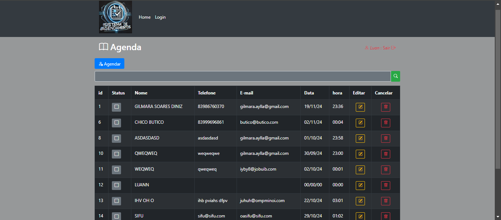

# Sistema de Agendamentos.
Este é um sistema web completo para gestão de agendamentos, onde clientes podem agendar um atendimento, enquanto administradores podem gerenciar fichas, e usuarios logados podem apenas editar no painel de controle.

# Visao Geral.
Este projeto foi desenvolvido para facilitar a criação e o gerenciamento de agendamentos de atendimentos ou serviços. Ele permite que:

clientes agendem e criem automaticamente uma ficha no painel de controle. 
Administradores possam acessar um painel completo para gerenciar estas fichas.
O sistema é desenvolvido em PHP com MySQL para o banco de dados, e está pronto para rodar em qualquer ambiente LAMP (Linux, Apache, MySQL, PHP).

# Exemplo Prático.

Um usuário acessa uma página (via Apache). 
O PHP processa a solicitação para exibir em tela. 
O PHP se conecta ao MySQL para buscar os dados. 
O servidor envia a página gerada dinamicamente para o navegador do usuário.

# Funcionalidades

. Cadastro de Agendamentos: Data, horário, e cliente. 
. Visualização dos Agendamentos: Lista de agendamentos em uma tabela. 
. Cancelamento ou Alteração de Agendamentos. 

#   Exibe a tela para realizar o Agendamento.

#    Necessario preencher todos os campos, mesmo que nao haja alteração.

 #   Tela de Login.

 #   Exibição do painel de controle do Admin.

 #   Exibição do painel de controle para (não admin)

 
